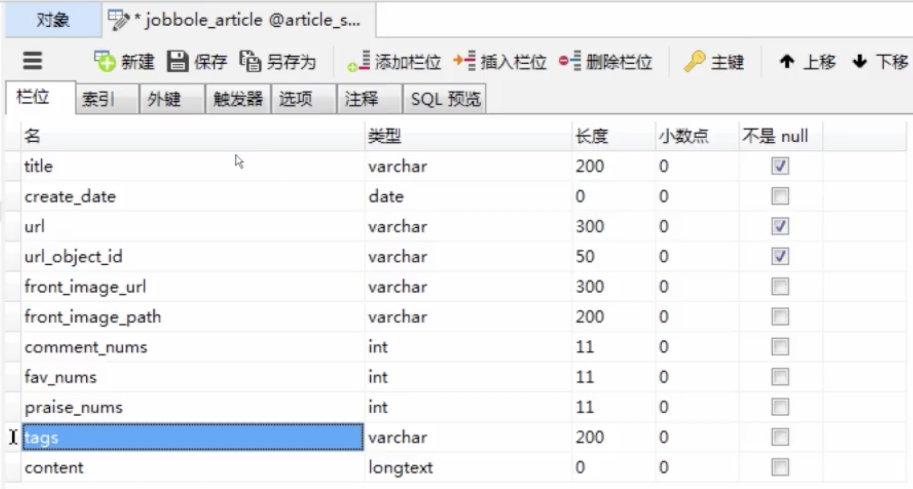

2018.03.19 20:01

作者博客
http://projectsedu.com
github.com/liyaopinner

IDE pycharm
数据库 mysql redis 

Python 2.7.13
Python 3.5.3

第三章 基础知识

技术选型:
scrapy 
requests
scrapy selector

网页分类：
静态网页
动态网页
微博service(rest api)

爬虫能做什么
1、搜索引擎-百度
2、推荐引擎-今日头条
3、机器学习的数据样本
4、数据分析、舆情分析

正则表达式
非贪婪模式 ？
至少出现一次 +
限定前面的字符出现的次数 {}
满足任意一个 []
\s 代表空格
\S 只要不是空格就行一个字符
\w 代表a-zA-Z0-9_ 代表字符
\W 不代表a-Z0-9_
\d 代表数字


深度优先和广度优先算法

深度优先 递归实现
广度优先 队列实现

数据结构里很重要的算法

深度优先过程

```py
def depth_tree(tree_node):
	if tree_node is not None:
		print(tree_node._data)
		if tree_node._left is not None:
			return depth_tree(tree_node._left):
		if tree_node._right is not None:
			return depth_tree(tree_node._right)
```

广度优先过程

```py
def level_queue(root):
	if root is None:
		return
	my_queue = []
	node = root
	my_queue.append(node)
	while my_queue:
		node = my_queue.pop(0)
		print(node.elem)
		if node.lchild is not None:
			my_queue.append(node.lchild)
		if node.rchild is not None:
			my_queue.append(node.rchild)
```
 
url去重策略

1、将访问过的url保存到数据库
2、将访问过的url保存到set中
3、url经过md5等方法哈希后保存到set中 scrapy使用的是这个方法
4、用bitmap方法，
5、bloomfilter方法对bitmap进行改进，多重hash函数降低冲突

unicode和utf8编码
内存中的数据都是unicode编码
python3中文件中存的数据是utf-8编码
所有编码解码 decode为unicode
uncode编码 encode为utf-8

获取系统默认的编码
sys.getdefaultencoding()

```py
-*- coding: utf-8 -*-
```

scrapy爬取jobbole


pycharm 中调试scrapy

main.py main.py放在和scrapy.cfg同一目录

```py
#!/usr/bin/env python
# -*- coding: utf-8 -*-
import os
import sys

from scrapy.cmdline import execute

# 查找main.py的执行位置
sys.path.append(os.path.dirname(os.path.abspath(__file__)))
# 执行爬虫
execute(['scrapy', 'crawl', 'jobbole'])
```

xpath语法
div[@class="goods-add fn-clear J-DAddToBag"]
//span[contains(@class, 'J-DAddToBag')]

/article/div[1] 选取属于article子元素的第一个div元素
/article/div[last()] 选取属于article子元素的最后一个div元素
/article/div[last()-1] 选取属于article子元素的倒数第二个div元素
//div/* 选取属于div元素的所有子节点
//div[@*] 选取所有带属性的title元素
/div/a|//div/p 选取所有div元素的a和p元素
//span|//ul 选取文档中的span和ul元素
article/div/p| //span 选取所有属于span元素的div元素的p元素以及文档中的所有的span元素


css selector语法
li a 选取所有li下的所有a元素
ul + p 选择ul后面的第一个p元素
div#container > ul 选取id为container的div的第一个ul子元素
ul ~ p 选取与ul相邻的所有p元素
a[title] 选取所有有title属性的a元素
a[href="http://jobbole.com"] 选取所有href属性为jobbole.com值的a元素
a[href*="jobbole"] 选取所有href属性包含jobbole.com的a元素
a[href^="http"] 选取所有href属性以http开头的a元素
a[href$=".jpg"] 选取所有href属性以.jpg结尾的a元素
input[type=radio]:checked 选择选中的radio的元素
div:not(#container) 选取所有id非container属性的div元素
li:nth-child(3) 选取第三个li元素
tr:nth-child(2n) 第偶数个tr

伪类选择器
h1::text
div h1::attr(href) 


列表生成式
tag_list = ['职场', '1 评论', 'fuck两点水']

[ element for element in tag_list if not element.strip().endswith("评论")]


正则表达式
fav_nums = "sssd123werwe"
match_re = re.match(".*(\d+).*", fav_nums)
if match_re:
	fav_nums = int(match_re.group(1))
else:
	fav_nums = 0
	

字符串方法
tags = ",".join('12345')        结果 '1,2,3,4,5'


response.xpath().extract() 需要异常处理
response.xpath().extract_first()


from scrapy.http import Request
Request(url=,callback=)

from urllib import parse
parse.urljoin()

meta
scrapy.Request(url=,meta={'goodsid':goodsid},callback=)
goodsid = response.meta.get("goodsid", "")

scrapy 图片管道 imagespipeline `pip install pillow`
settings.py
scrapy.pipelines.images.ImagesPipeLine
IMAGES_URLS_FIELD = "items.py 中的item,url需要是list类型"
project_dir = os.path.abspath(os.path.dirname(__file__))
IMAGES_STORE = os.path.join(project_dir, 'images')

[DIY pipeline](https://coding.imooc.com/lesson/92.html#mid=2878)
图片管道自定义
4-12 items设计-3 视频的02:12

ImagesPipeline
item_completed()

utils/
__init__.py
common.py

```py
import hashlib

def get_md5(url):
	if isinstance(url, str):
		url = url.encode("utf-8")
	m = hashlib.md5()
	m.update(url)
	return m.hexdigest()
	
	
if __name__ == "__main__":
	print(get_md5("http://www.baidu.com")
```


数据保存
pipeline

```py
import codecs


class JsonPipeline(object):
	def __init__(self):
		self.file = codecs.open('article.json', 'w', encoding="utf-8")
		
	def process_item(self, item, spider):
	lines = json.dumps(dict(item), ensure_ascii=False) + "\n"
	self.write(lines)
	return item
	
	def close_spider(self, spider):
            self.file.close()

```

JsonItemExporter

```py
from scrapy.exporters import JsonItemExporter


class JsonExporterPipeline(object):
	def __init__(self):
		self.file = open('articleexporter.json', 'wb')
		self.exporter = JsonItemExporter(self.file, encoding="utf-8", ensure_ascii=False)
		self.exporter.start_exporting()
	
	def process_item(self. item, spider):
		self.exporter.export_item(item)
		return item
		
	def close_spider(self, spider):
		self.exporter.finish_exporting()
		self.file.close()
		
```


数据库

新建数据库
新建数据表



```py
create_date = '时间字符串'
try:
	datetime.datetime.strptime(create_date, "%Y/%m/%d").date()
except Exception as e:
	create_date = datetime.datetime.now().date()
```

pip install mysqlclient pymysql

同步插入mysql

```py
class MysqlPipeline(object):
	def __init__(self):
		self.conn = pymysql.connect('host', 'user', 'password', 'port', 'dbname', charset="utf-8", use_unicode=Ture)
		self.cursor = self.conn.cursor()
		
	def process_item(self, item, spider):
		insert_sql = """
			insert into jobbole_article(title, url)
			VALUES (%s,%s)"""
		self.cursor.execute(insert_sql, (item["title"], item["url"])
		self.conn.commit()
```

异步插入mysql

连接池

```py
from twisted.enterprise import adbapi


class MysqlTwistedPipeline(object):
	def __init__(self):
		self.dbpool = dbpool
	
	@classmethod
	def from_settings(cls, settings):
		dbparms = dict(
			host = settings["MYSQL_HOST"],
			db = settings["MYSQL_DBNAME"],
			user = settings["MYSQL_USER"],
			password = settings["MYSQL_PASSWORD"],
			charset = 'utf-8',
			cursorclass = pymysql.cursors.DictCursor,
			use_unicode = True,
		)
		dbpool = adbapi.ConnectionPool("pymysql", **dbparms)
		
		return cls(dbpool)
	
	def process_item(self, item, spider):
		query = self.dbpool.runInteraction(do_insert, item)
		query.addErrback(self.handle_error)
		
	def handle_error(self, failure):
		print(failure)
		
	def do_insert(self, cursor, item):
		insert_sql = """
			insert into jobbole_article(title, url)
			VALUES (%s,%s)"""
		cursor.execute(insert_sql, (item["title"], item["url"])
```

scrapy-djangoitem

pip install scrapy-djangoitem


scrapy item loader 机制

itemloader会将所有提取的值变为list类型

```py
from scrapy.loader import ItemLoader


item_loader = ItemLoader(item=JobboleItem(),response=response)

itemloader.add_xpath()
itemloader.add_css()
itemloader.value()

item = itemloader.load_item()

yield item

```

items.py

```py
from scrapy.loader.processors import MapCompose

#取第一个值
from scrapy.loader.processors import TakeFirst，Join


def add_jobbole(value):
	return value + "-jobbole"
	

title = scrapy.Field(
	input_processor = MapCompose(add_jobbole)
)

name = scrapy.Field(
	input_processor = MapCompose(lambda x:x+"-jinlong")
)

urls = scrapy.Field(
	input_processor = MapCompose(lambda x:x+"-kjj", add_jobbole)
)

create_date = scrapy.Field(
	input_processor = MapCompose(add_jobbole)
	output_processor = TakeFirst()
)
```

自定义itemloader

```py
class ArticleItemLoader(ItemLoader):
	default_output_processor = TakeFirst()
```

session和cookie自动登录机制
session服务器端
cookie客户端

settings.py
AUTOTHROTTLE_ENABLED = True

spider.py

custom_settings = {
	"COOKIES_ENABLED": True
}


selenuim driver

ChromeDriver - WebDriver for Chrome

https://sites.google.com/a/chromium.org/chromedriver/downloads

brew install chromedriver

https://segmentfault.com/a/1190000013067705

```py
from selenium.webdriver.chrome.options import Options
chrome_options = Options()
chrome_options.add_argument('window-size=1920x3000') #指定浏览器分辨率
chrome_options.add_argument('--disable-gpu') #谷歌文档提到需要加上这个属性来规避bug
chrome_options.add_argument('--hide-scrollbars') #隐藏滚动条, 应对一些特殊页面
chrome_options.add_argument('blink-settings=imagesEnabled=false') #不加载图片, 提升速度
chrome_options.add_argument('--headless') #浏览器不提供可视化页面. linux下如果系统不支持可视化不加这条会启动失败
chrome_options.binary_location = r'/Applications/Google Chrome Canary.app/Contents/MacOS/Google Chrome Canary' #手动指定使用的浏览器位置
```