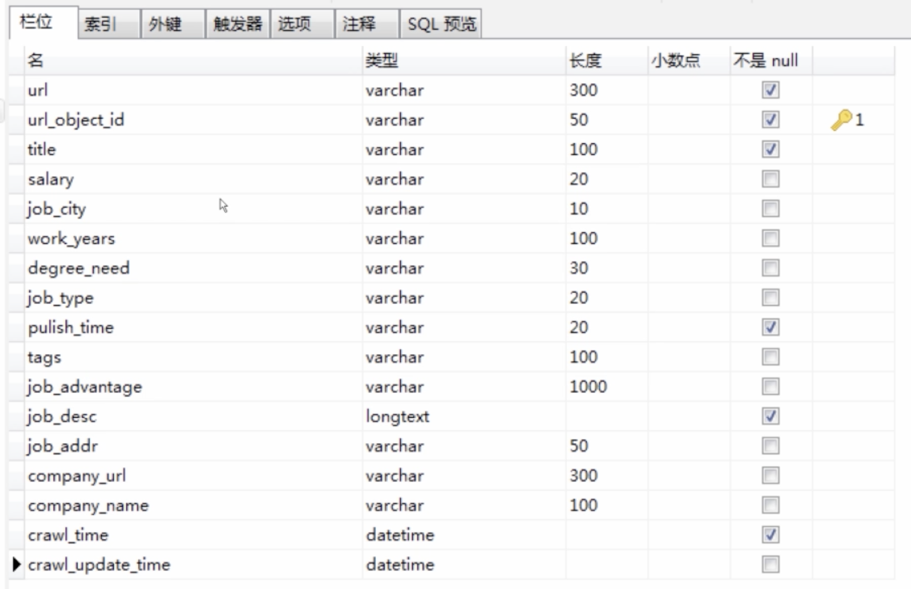

Windows下类似linux的终端 ·cmder·


数据库 article_spider

数据表 lagou_job

设计数据表结构




编写CrawlSpider

查看scrapy spider提供的模板

```shell
scrapy genspider --list
```

生成crawlspider

```shell
scrapy genspider -t crawl lagou www.lagou.com
```

变量PYTHONPATH

```python
import sys
import os


project_dir = os.path.abspath(os.path.dirname(__file__))
BASE_DIR = os.path.dirname(os.path.abspath(os.path.dirname(__file__)))
sys.path.insert(0, os.path.join(BASE_DIR, 'ArticleSpider'))
```

CrawlSpider是个什么类？

Rule


LinkExtractor


